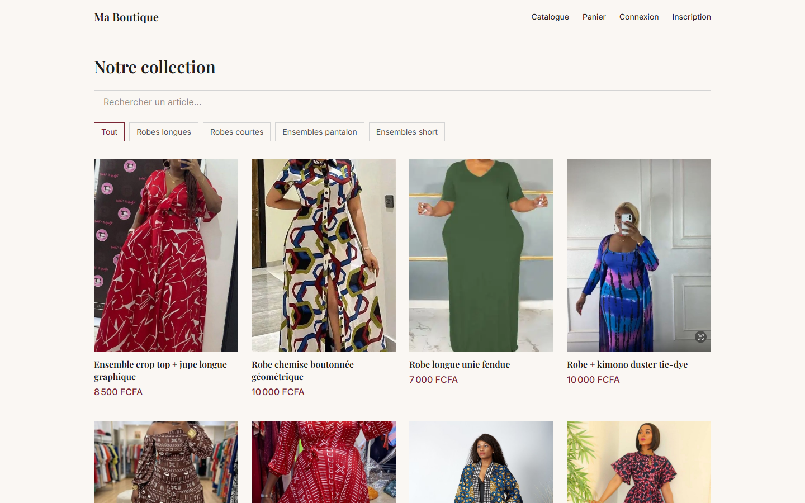
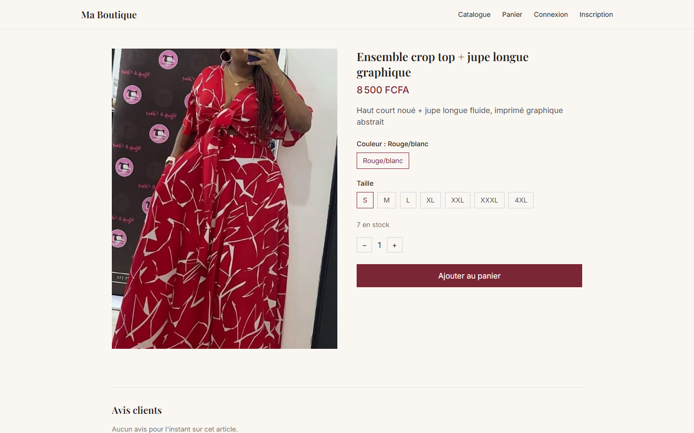
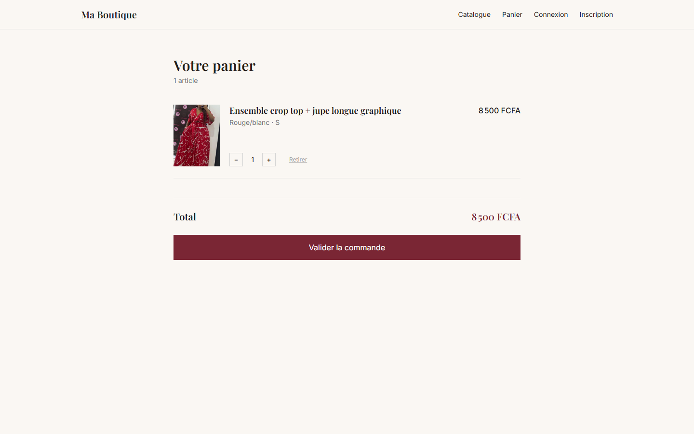
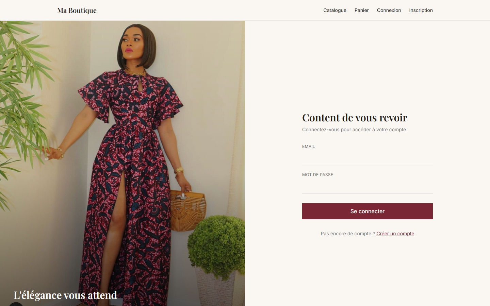
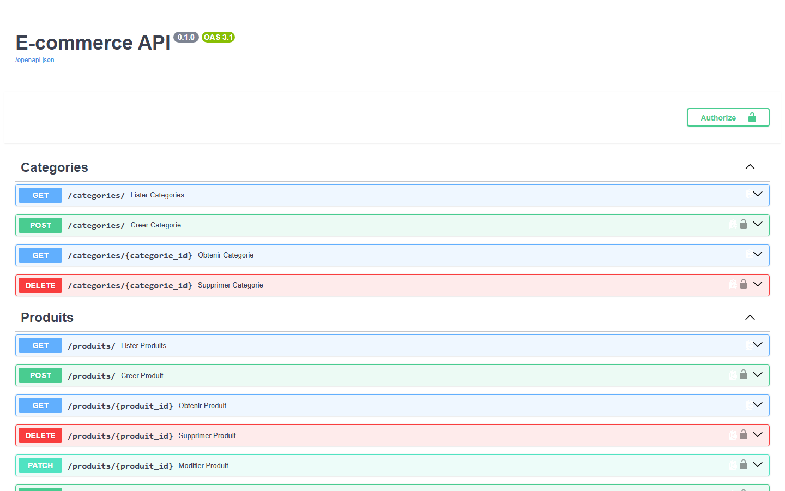

# Ecommerce Mode Femme

Application e-commerce complète : API backend en FastAPI (Python) et
interface frontend en React + TypeScript (Vite).

## Structure du projet

```
ecommerce/
  backend/   API FastAPI (produits, categories, commandes, paiement, avis, auth)
  frontend/  Application React (catalogue, fiche produit, panier, compte)
```

## Captures d'écran

| | |
|---|---|
|  |  |
| **Catalogue** | **Fiche produit** |
|  |  |
| **Panier** | **Connexion** |
|  | |
| **Documentation API interactive** | |
